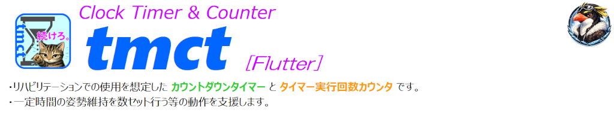

<p align="left">
  
  
</p>
<!--
  
-->

    

# Clock Timer & Counter [tmct_flt] - Rehabilitation Timer
<p align="left">
  
</p>

## Overview
　**Android** / **iOS** 向けに **Flutter** で開発したカウントダウンタイマーです。  
　日付・現在時刻・カウントダウンタイマー、実施セット数を表示します。  
　リハビリテーションやストレッチ、一定時間の姿勢維持などに利用できます。  

## Purpose
* 日付･現在時刻(秒表示)  
* カウントダウンタイマー  
* Start / Stop / Clear  
* 残り10秒から 赤 ⇒ 黄 ⇒ 赤 と変化  
* タイマー実行回数の自動カウント  
* ストップ後の停止時間からの再スタート  
* タイマー初期時間変更
* 各設定を画面上で行う**UI**を採用　　　# 設定画面を無くし、直感的に操作可能  

## Features
* Android / iOS 共通UI
* 画面スリープ防止
* タイマー終了時に自動でセット数加算
* Stop後の途中再開
* 残り10秒からの色変更によるラストスパートの演出
* 初期時間･セット数の変更

## Usage
1. 時･分･秒を設定 (タップして数字を指定)
2. 実行回数設定 (タップして数字を指定 又は **⊕** / **⊖** ボタンによる増減) 
3. [Start] ⇒ 時間経過 (残り10秒で表示色変化) ⇒ 停止 ⇒ 自動リセット
4. 場合により [Stop] ⇒ [Start]　　# 停止秒から再開
5. [Clear] で初期状態復帰
6. [現在の時間･セット数を初期値に設定] で初期値変更 (任意)

## Use Case
- リハビリテーションでの一定時間姿勢保持を支援
- インスタント食品の調理時間計測
- その他一般的な作業の時間計測及び回数確認

## UI Components
### Input items
>| Item | Description |
>| :--| :--|
>| YYYY-MM-DD| 現在日付 |
>| HH:MM:SS | 現在時刻 |
>| HH:MM:SS | タイマー時間 |
>| セット | 繰り返し回数 |
### Buttons
>| Item | Description |
>| :--| :--|
>| Start | カウントダウン開始 |
>| Stop | カウントダウン停止 |
>| Clear | 時間、回数リセット |
>| 時 | タイマー時 設定 |
>| 分 | タイマー分 設定 |
>| 秒 | タイマー秒 設定 |
>| 目標セット数 | タイマー実行回数 |
>| 現在の時間･セット数を初期値に設定 | 指定した時間とセット数を初期値に設定 |

## Tech Stack
* Flutter
* wakelock_plus　　# タイマー動作中の画面点灯保持用
* AndroidStudio

## Design / Implementation Points
- タイマーとその実行回数確認に特化
- 説明を不要とするUI
- タイマー再開時のストップ時間保持
- 残り10からの表示色変化によるラストスパートの視覚的サポート

## Why Flutter
　本ツールはSourceCodeを Android / iOS 共通とするためにFlutterを使用しています。
- Android / iOS 共通UI
> [!CAUTION]
> Xpedia10 IV 及び AndroidStudio Emulator(Pixel7) にて動作検証を行っています。  
> iOS用コードは同じプロジェクト内に保持されますが、iOSアプリのビルドと実機確認にはmacOSとXcodeが必要です。  
> Mac版はPCを用意できた時点で、プロジェクトを検証する予定です (人身御供になっていただけると幸いです)。  

## Build (for Windows) 
　Flutter SDKとAndroid Studioをセットアップした後、PowerShellで実行します。  
> [!NOTE]  
>  <⏎> : Press the Enter key.  

　  
```pwsh
　flutter doctor <⏎>  
　　　: # Execution Result
　flutter create --platforms=android,ios tmct_flt <⏎>  
　　　: # Execution Result
　tree /f app_dir <⏎>  
　app_dir  
　　│    pubspec.yaml  
　　└─ lib  
　　     main.dart  
``` 
　その後、プロジェクトのディレクトリで実行します。  

　  
```pwsh
　flutter pub get <⏎>  
　　　: # Execution Result
　flutter run <⏎>  
　　　: # Execution Result
``` 
　接続中のAndroid端末を指定する場合：  
　  
```pwsh
　flutter devices <⏎>  
　　　: # Execution Result
　flutter run -d <device-id> <⏎>  
　　　: # Execution Result
``` 
## Android APKの作成
　動作確認用：  
　  
```pwsh
　flutter build apk --debug <⏎>  
```  
　配布用：  
　  
```pwsh  
　flutter build apk --release <⏎>  
```   
　生成先：   
　　🗁 build/app/outputs/flutter-apk/app-release.apk  
　生成した **app-release.apk** をアプリケーション名に変更して配布  

## Download
　🔗 https://github.com/AHazeyama/public/releases/latest  

## Development Tutorial  
　🔗[tmct_flt_AndroidStudio](./tmct_flt_AndroidStudio.md)  
> [!CAUTION]
> 現在作成中につき、内容は保証できません。 

## License
　TBD
