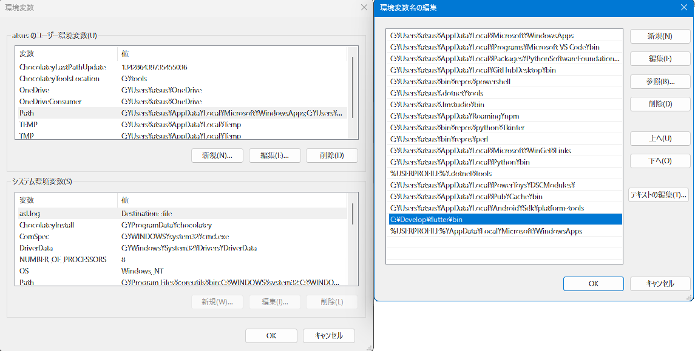
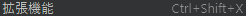
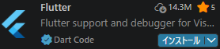
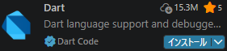
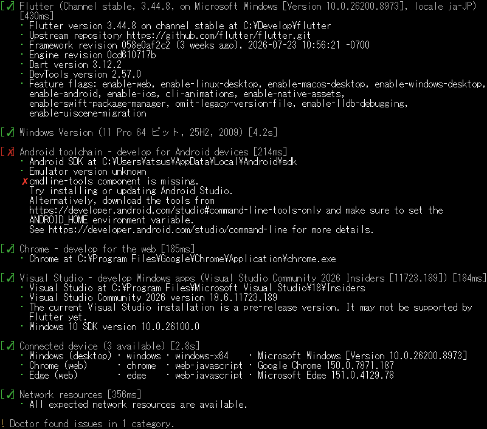
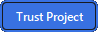
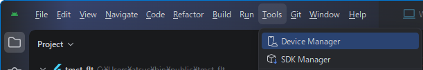
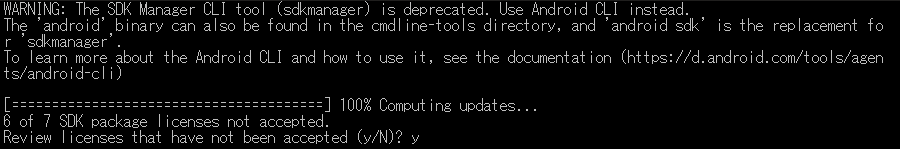
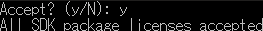
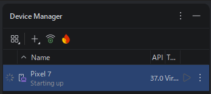

<p akugb=:keft>  
	  
	  
</p>  
<!--

-->

# 開発ツールインストール												<!-- 01 -->    
　**SDK(Flutter)** 及び **IDE(Android Studio)** のインストールと環境設定を行います。  

> [!NOTE]  
> 縮小表示されている画像は⬇️で拡大されます。  
> 
> ```pwsh  
> ※ 記号例  
> 　🪟:デスクトップ、⬇️:マウスクリック、 [･･･]:ボタン、<･･･>:Press the Key、⇒:次動作、#･･･:コメント  
> 　"･･･":テキスト、a/b:選択(a or b)、｢･･･｣:ウィンドウ/メニュー/フォーム、  
> ```  

## インストール済みツール確認												<!-- 01-01 -->  
　  
```pwsh
　git --version <⏎>  
```  
　　  
```pwsh
　code --version <⏎>  
```  
　　  

## Flutter(Framework) & Dart(Language) インストール						<!-- 01-02 -->  
　　👇ボタンより FlutterSDK バンドルをダウンロード  
　　[](https://storage.googleapis.com/flutter_infra_release/releases/stable/windows/flutter_windows_3.44.8-stable.zip)  🔗[Install Flutter manually](https://docs.flutter.dev/install/manual)  
　解凍して任意のフォルダへ保存　　推奨：🗁 C : \Develop\  

## 環境変数登録															<!-- 01-03 -->  
### インストール&Path確認  
　画面左下の  へ"環境変数"を入力して [](./assets/env/M_env-val-icon.png) を⬇️  
　｢･･･のユーザー環境変数(<u>U</u>)｣ ⇒ ｢Path｣ ⇒ [編集(<u>E</u>)…] ⇒ ｢環境変数名の編集｣/[新規] ⇒ 追加 "C:\Develop\flutter\bin"  
　　　[](./assets/prtsc/01-03-01_Env-val-cntl.png)  

　  
```pwsh
　flutter --version <⏎>
```  
　　[](./assets/prtsc/01-03-02_flutter-version.png)  
```pwsh
　dart --version <⏎>
```  
　　  
  
### VS Code への機能拡張追加  
　左ツールバーの  ⬇️ 、又は  ️⬇️ ⇒ ⬇️ ⇒  
　　**/**　　インストール   

### Flutter初回診断  
　  
```pwsh
　flutter doctor -v <⏎>  
```  
　　[](./assets/prtsc/01-03-04_flutter-doctor-error.png)  
> [!IMPORTANT]  
> この時点では Android Studio / cmdline-tools がインストールされていないため、にエラーが出る。  
> Flutterがインストールされていれば **OK**  

## Android Studio(IDE) インストール										<!-- 01-04 -->  
　  
　インストーラ入手  
　　🔗[Android Studio](https://developer.android.com/studio?hl=ja)　※使用許諾の必要があるため、リンク先の  よりダウンロード  
　　 W⬇️  
　　デフォルト設定でインストール  
　　SDKインストール先 : 🗁 C:\Users\ユーザー名\AppData\Local\Android\Sdk  

### プロジェクト作成  
|Welcome to<br>Android Studio|Trust and Open<br>Project|  
|:---:|:---:|  
|[](./assets/prtsc/01-04-01_welcomeAS.png) |[](./assets/prtsc/01-04-02_trust-and-openproject.png)|  
|｢Open｣ ⬇️| ⬇️|

> [!important]
> **tmct_flt** は **main.dart** 及び **pubspec.yaml** を別途作成し、Android Studioに読み込ませています。

### SDK インストール  
　  
　　[](./assets/env/M_as_menu-bar-SDK_Maneger.png)  
　Menu ｢｣ ⬇️ ⇒ ｢Tools」 ⇒ 「SDK Manager」⬇️ ⇒  SDKインストール   

|Item|Content|Remarks|  
|:---|:---|:---|  
|SDK Platforms|Android 16.0 ("Baklava")|Emulator用なので、一般的なSDKで|
|SDK Tools|Android SDK Build-Tools<br>　　37.0.0<br>　　36.1.0<br>　　36.0.0<br>Android Emulator<br>Android SDK Platform-Tools|<br>┐<br>┼─　｢  ｣ で表示<br>┘<br> <br> <br>|  

　　🔗[SDKインストール方法詳細](./SDK-Introduction.md)  

> [!IMPORTANT]
> 項目の左に []️ がある場合は、先にクリックしてインストールすること。  

### Emulator(Pixel7)インストール  
　  
　　  
　Menu ｢️｣⬇️ ⇒ ｢Tools」 ⇒ 「SDK Manager」⬇️ ⇒  スマートフォンイメージ インストール   

#### 設定内容  
|Item|Content|Remarks|  
|:---|:---|:---|  
|name|Pixel 7||
|API|API 36.1 "Baklava";Android 16||
|Services|Google Play Store||
|System Image|16KB Page Size Google Play Intel x86 64 Atom System Image||

　　🔗[Device設定方法詳細](./Device-Introduction.md)  
> [!IMPORTANT]
> 項目の左に []️ がある場合は、先にクリックしてインストールすること。  

### Android ライセンス承認  
　  
```pwsh
　flutter doctor --android-licenses <⏎>  
```  
　  
　以降、何度か"Accept? (y/N)"と聞かれるので、全て\<y\>で **OK**  

　  
　上記メッセージを確認できれば承認完了。

### 完了確認
次の状態になっていれば、開発環境の構築は完了です。
- `flutter doctor -v` でFlutter及びAndroid toolchainが認識される
- Androidライセンスが承認済み
- Android StudioからPixel 7 Emulatorを起動できる
- VS CodeでFlutter及びDart拡張機能が有効になっている

  
## Emulator起動															<!-- 01-05 -->  
　  
　Menu ｢️｣⬇️ ⇒ ｢Tools」 ⇒ ｢Device Manager｣⬇️ ⇒  
　　  

　｢Device Manager｣⬇️ ⇒ 　　　｢**＋**｣⬇️ ⇒ 　　　　　　　　｢Create Virtual Device｣⬇️  
　　 
　 
　
　 
　[](./assets/prtsc/01-05-03_Emulator-Pixel7-1st.png)  
