<p akugb=:keft>  
	  
	  
</p>  
<!--  
  
-->  
  
# 開発ツールインストール												<!-- 01 -->    
　**SDK(Flutter)** 及び **IDE(Android Studio)** のインストールと環境設定を行います。  
  
> [!NOTE]  
> 凡例  
> [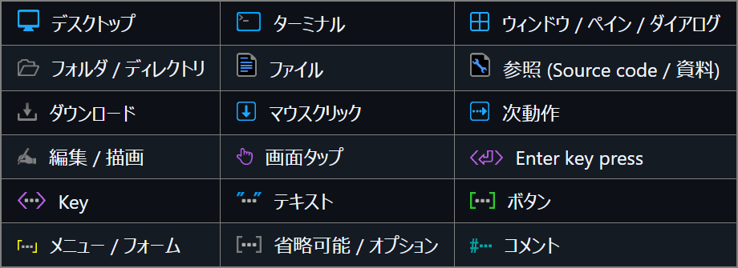](./assets/env/M_legend.png)  
>  
> 縮小画像 (マウスカーソルが  に変化する画像) は  で拡大表示します。  
>  
> Source code / コマンド は   でText表示します (表示されたTextの右上にある   でコピー)。  
>  
>  ブラウザを **Darkモード** にして頂けると、見やすくなります。  
>  
>  コマンドは全て  で実行します。  
  
## インストール済みツール確認							<!-- 01-01 -->  
  
<details>  
<summary>  
　  
　  
  
</summary>   
  
```pwsh  
git --version  
```  
</details>  
  
　  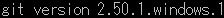  
  
<details>  
<summary>  
　  
　  
  
</summary>   
   
```pwsh  
code --version  
```  
  
</details>  
  
　　  
  
  
  
## Flutter(Framework) & Dart(Language) インストール						<!-- 01-02 -->  
　　 ボタンより **FlutterSDK** バンドルをダウンロード  
　　[](https://storage.googleapis.com/flutter_infra_release/releases/stable/windows/flutter_windows_3.44.8-stable.zip)　 [Install Flutter manually](https://docs.flutter.dev/install/manual)  
　解凍して任意のフォルダへ保存　　推奨： C : \Develop\  
  
## 環境変数登録															<!-- 01-03 -->  
### インストール&Path確認  
　 左下の  へ 環境変数 を入力して [](./assets/env/M_env-val-icon.png) を    
　 環境変数/   のユーザー環境変数(<u>U</u>)   　 Path   　 編集(<u>E</u>)…     
　　　 環境変数名の編集/  新規   　**追加** C:\Develop\flutter\bin 　 **OK**     
　 環境変数/  **OK**    
　　　[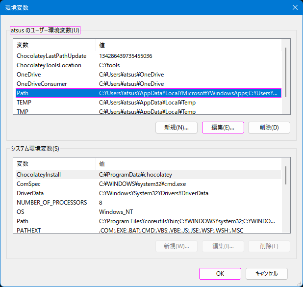](./assets/prtsc/M_CNTL_env-user-path.png)　　[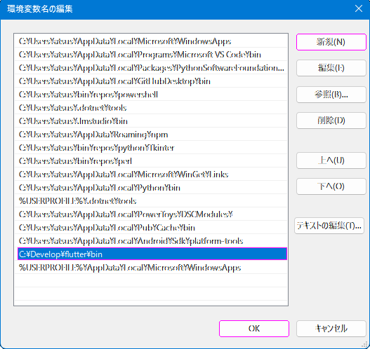](./assets/prtsc/M_CNTL_env-user-path-add.png)  
  
<details>  
<summary>  
　  
　  
  
</summary>   
  
```pwsh  
　flutter --version  
```  
  
</details>  
  
　　[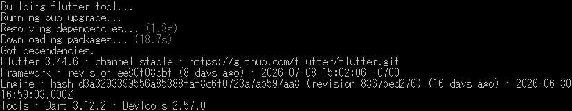](./assets/cmd/M_CMD_01-03_flutter=--version-R.png)  
  
> [!warning]  
> Flutterの新しいバージョンが存在する場合のメッセージ  
> 　　　　　　　　　　　　　　　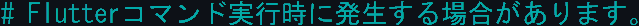  
> 　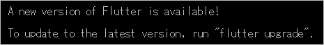  
> アップグレード手順  
>  AndroidStudioを終了してから実行すること。  
> <details>  
> <summary>  
> 　  
> 　  
>  
> </summary>   
>  
> ```pwsh  
> flutter upgrade  
> ```  
>   
> </details>  
>   
> 　[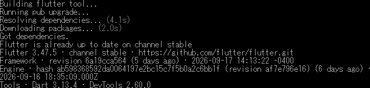](./assets/cmd/M_CMD_00-02_flutter=upgrade-R.png)  
  
<details>  
<summary>  
　  
　  
  
</summary>   
   
```pwsh  
　dart --version  
```  
  
</details>  
  
　　[](./assets/cmd/M_CMD_01-04_dart=--version-R.png)  
  
### VS Code への機能拡張追加  
　左ツールバーの  ️ 、又は  ️️  　️    
　　 　　インストール   
  
### Flutter初回診断  
  
<details>  
<summary>  
　  
　  
  
</summary>   
  
```pwsh  
　flutter doctor -v  
```  
  
</details>  
  
　　[](./assets/cmd/M_CMD_01-05_flutter=doctor=-v-R-E.png)  
> [!IMPORTANT]  
> この時点では Android Studio / cmdline-tools がインストールされていないため、にエラーが出る。  
> Flutterがインストールされていれば **OK**  
  
## Android Studio(IDE) インストール										<!-- 01-04 -->  
　  
　  
　インストーラ入手  
　　 [Android Studio](https://developer.android.com/studio?hl=ja)　※使用許諾の必要があるため、リンク先の  よりダウンロード  
　　 W デフォルト設定でインストール  
　　SDKインストール先 :  C:\Users\ユーザー名\AppData\Local\Android\Sdk  
  
### プロジェクト作成  
|Welcome to<br>Android Studio|Trust and Open<br>Project|  
|:---:|:---:|  
|[](./assets/prtsc/M_AS_01-04_welcomeAS.png) |[](./assets/prtsc/M_AS_01-04_trust-and-openproject.png)|  
| Open  ️| |  
  
> [!important]  
> **tmct_flt** は **main.dart** 及び **pubspec.yaml** を別途作成し、Android Studioに読み込ませています。  
  
### SDK インストール  
　  
　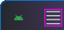  　 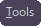   　  ️ 　SDKインストール   
　[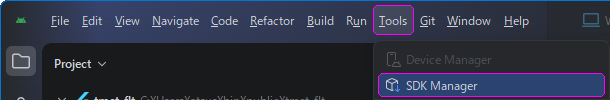](./assets/prtsc/M_AS_menu-bar-SDK_Maneger.png)  
  
|Item|Content|Remarks|  
|:--|:--|:--|  
|SDK Platforms|Android 16.0 ("Baklava")|Emulator用なので、一般的なSDKで|  
|SDK Tools|Android SDK Build-Tools<br>　　37.0.0<br>　　36.1.0<br>　　36.0.0<br>Android Emulator<br>Android SDK Platform-Tools|<br>┐<br>┼─　   で表示<br>┘<br> <br> <br>|  
  
#### 　 [SDKインストール方法 詳細](./SDK-Introduction.md)  
  
### Emulator(Pixel7)インストール  
　  
　 ️ 　   　   ️  　スマートフォンイメージ インストール   
　[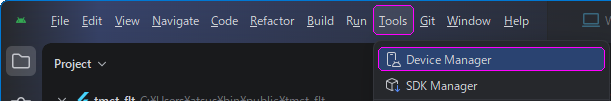](./assets/prtsc/M_AS_menu-bar_Device_Maneger.png)  
  
　 Device Maneger  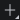  　　    　　　　　　 スマートフォン登録  
　[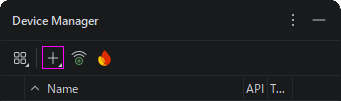](./assets/prtsc/M_AS_DeviceManeger-1st.png)　　[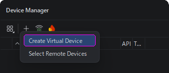](./assets/prtsc/M_AS_DeviceManeger-1st.png)　　[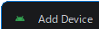](./assets/prtsc/M_AS_DeviceManeger-1st.png)  
  
#### スマートフォン登録内容  
|Item|Content|Remarks|  
|:---|:---|:---|  
|name|Pixel 7||  
|API|API 36.1 "Baklava";Android 16||  
|Services|Google Play Store||  
|System Image|16KB Page Size Google Play Intel x86 64 Atom System Image||  
#### 　 [スマートフォン登録方法 詳細](./Device-Introduction.md)  
  
### Android ライセンス承認  
<details>  
<summary>  
　  
　  
  
</summary>   
   
```pwsh  
　flutter doctor --android-licenses  
```  
  
</details>  
  
　[](./assets/cmd/M_CMD_01-06_flutter=doctor=--android-licenses-R.png)  
　以降、何度か  Accept? (y/N) と聞かれるので、全て  y で **OK**  
　　　　　　　　　  
　  
　上記メッセージを確認できれば承認完了。  
  
### 完了確認  
次の状態になっていれば、開発環境の構築は完了です。  
- `flutter doctor -v` でFlutter及びAndroid toolchainが認識される  
- Androidライセンスが承認済み  
- Android StudioからPixel 7 Emulatorを起動できる  
- VS CodeでFlutter及びDart拡張機能が有効になっている  
  
  
## Emulator起動															<!-- 01-05 -->  
　  
　  　   　      
　  
  
　 Device Maneger  Pixel7  　　  　　　　　　　　　　 Pixel7 Home  
　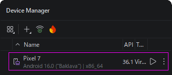　　　　　　　　　　　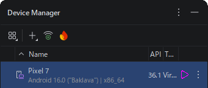　　[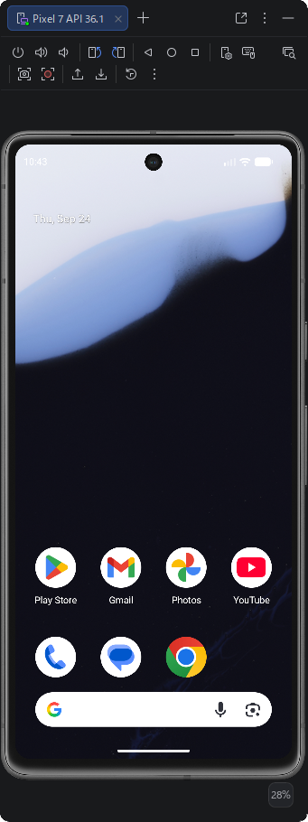](./assets/prtsc/M_AS_Pixel7-HOME-initial.png)  