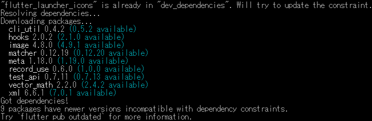
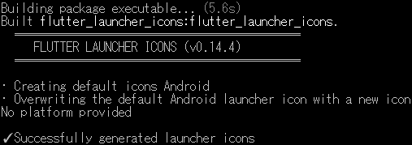
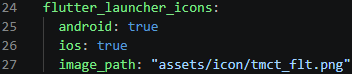
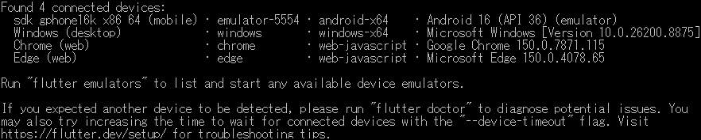
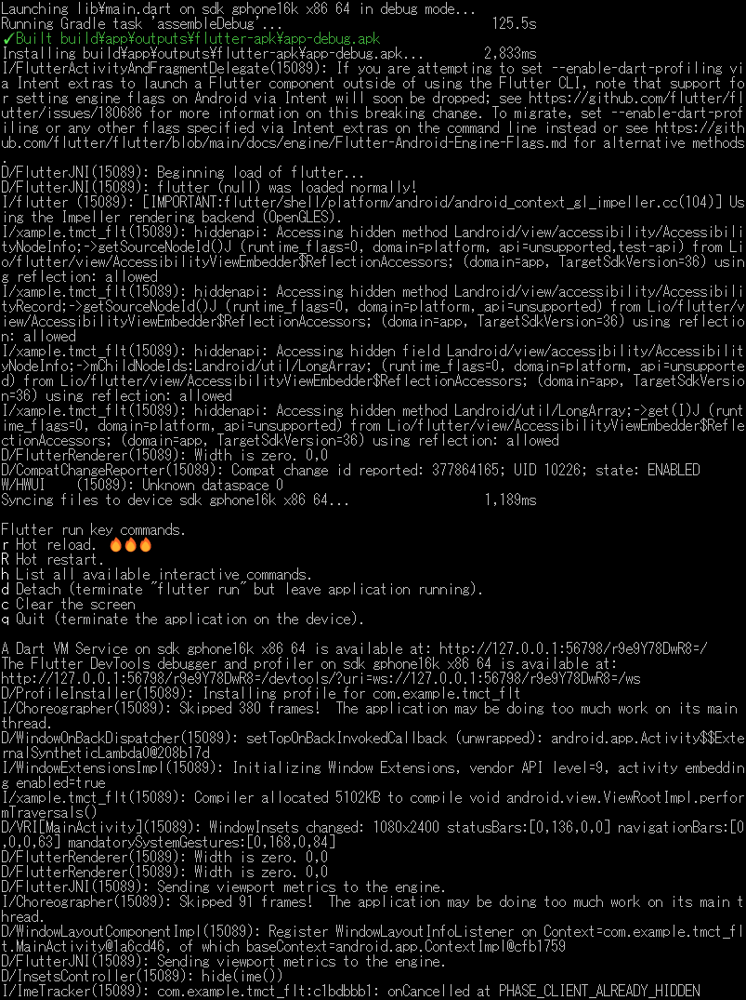
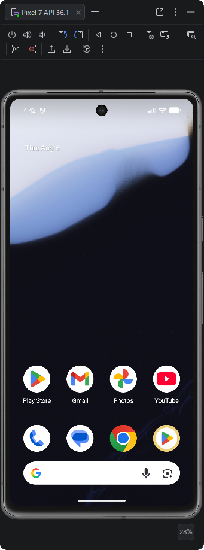
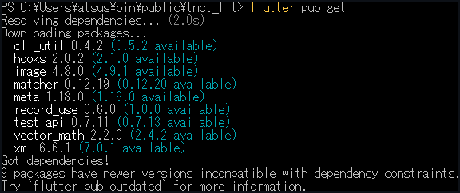

<p akugb=:keft>  
	  
	  
</p>  
<!--

-->

# Mobileアプリケーション作成											<!-- 02 -->  
　リハビリテーション用カウントダウンタイマー&カウンター [**tmct_flt**] を作成します。  
　
> [!NOTE]  
> 縮小表示されている画像は⬇️で拡大されます。  
> 
> ```pwsh  
> ※ 記号例  
> 　🪟:デスクトップ、⬇️:マウスクリック、 […]:ボタン、<…>:Press the Key、⇒:次動作、#…:コメント  
> 　"…":テキスト、a/b:選択(a or b)、｢…｣:ウィンドウ/メニュー/フォーム、  
> ```  

## Coding																<!-- 02-01 -->  
　コーディング過程は省略。  
　ソースコード[tmct_flt]は下記参照。  
| Created file | 🗁 Location |  
|:---|:---|  
| [🔗main.dart](https://github.com/AHazeyama/public/blob/main/tmct_flt/lib/main.dart) | Project_dir \ lib \ |  
| [🔗pubspec.yaml](https://github.com/AHazeyama/public/blob/main/tmct_flt/pubspec.yaml) | Project_dir \ |  
| [🔗AndroidManifest.xml](https://github.com/AHazeyama/public/blob/main/tmct_flt/android/app/src/main/AndroidManifest.xml) | Project_dir \ android \ app \ src \ main \ |  

## アプリケーションのインストール										<!-- 02-02 -->
#### 開発環境確認  
　
```pwsh  
　flutter doctor -v <⏎>
```  
　　[](./assets/prtsc/02-02-01_flutter-doctor.png)  
```pwsh  
　flutter devices <⏎>
```  
　　[](./assets/prtsc/02-02-02_flutter-devices.png)  

#### ファイルバックアップ  
　｢Coding｣で作成したファイルをバックアップ。  
#### Androidフォルダ生成  
　
```pwsh  
　flutter create --platforms=android --project-name tmct_flt . <⏎>  
```  
　　[](./assets/prtsc/02-02-04_flutter-pub-get.png)  

#### パッケージ取得  
　  
```pwsh  
　flutter pub get <⏎>  
```  
　　  
　
#### アイコン生成  
　  
　アイコンファイル追加  
```pwsh  
　flutter pub add --dev flutter_launcher_icons <⏎>  
```  
　　[](./assets/prtsc/02-02-05_flutter-pub-add.png)  

　アイコンファイル登録  
```pwsh  
　dart run flutter_launcher_icons <⏎>
```  
　　  


> [!NOTE]
> [](./assets/prtsc/02-02-06_dart-run-flutter_luncher_icons_warn.png)  
> iOS環境を作成していない場合、上記Warningが出力される。  
> 原因はiconファイルのフォルダ階層かファイル名の不一致。  
> またはpubspec.yamlで"ios:**True**"になってる ⇒ **False**へ変更。  
>   

　本チュートリアルでは自動生成されたサンプルテストを使用しないため、testフォルダを削除します。
　　🗁: .\ Project_dir \  TEST  

　  
```pwsh  
　flutter analyze <⏎>  
```  
　　  

> [!NOTE]
> 参考:TESTフォルダを削除しなかった場合のメッセージ  
> 

#### インストール  
　  
　Emulator 確認 (FlutterからAndroid StudioのEmulatorが操作可能かを確認)  
```pwsh  
　flutter devices <⏎>
```  
　  
　Emulator へインストール   
```pwsh  
　flutter run -d emulator-5554 <⏎>
```  
　[](./assets/prtsc/02-02-10_flutter-run-emulator-5554.png)　　

　Emulator表示の遷移  
|Initial|Installing...|Running|After execution|  
|:---|:---|:---|:---|  
|[](./assets/prtsc/02-02-09_emulator01.png)|[](./assets/prtsc/02-02-11_emulator02.png)|[](./assets/prtsc/02-02-12_emulator03.png)|[](./assets/prtsc/02-02-13_emulator04.png)|  

## デバッグ (Emulator)													<!-- 02-03 -->  
　Android StudioからEmulatorを起動し、tmct_fltをデバッグ実行します。
### 操作手順  
1. Emulatorを起動
2. tmct_fltプロジェクトを開く
3. 実行対象デバイスを選択
4. Debugを実行
5. ログ及び動作を確認

### 主な確認項目  
- タイマーが設定値からカウントダウンする
- Start、Stop、Clearが正しく動作する
- カウンターが正しく更新される
- 残り10秒で表示が変化する
- 終了時に音及び振動が動作する
- 設定値が保存される
- Version等、設定内容が記録されている  

<!-- 後日、SoftwareDevelopmentGuide整備後に記載
#### 項目設定方法  
　[🔗SoftwareDevelopmentGuideへのリンク]  
-->
## 配布用アプリケーション(.apk)作成										<!-- 02-04 -->
### バージョン設定  
　pubspec.yaml 内で設定  
　　  
　バージョン内容  
　　
|Version Name|Details of Add-ons|  
|:---|:---|  
|Major version|主要機能の追加|  
|Minor version|機能変更、小規模追加|  
|Bug fixes|バグ対策|  
|build no|機能変更を伴わない修正、内部的なバグ対策|  

### Release Build  
　  

#### 環境整備  
```pwsh
　flutter clean <⏎>
```
　　  

#### パッケージ取得  
```pwsh  
　flutter pub get <⏎>  
```  
　　  

#### Build  
```pwsh  
　flutter build apk --release <⏎>
```  
　　[](./assets/prtsc/02-04-05_flutter-build-apk-release.png)  
　Buildアプリケーション保存 🗁 : `Project folder` \build\app\outputs\flutter-apk\  

#### アプリケーションリネーム  
　Buildで生成される.apkは **app-release.apk** となっているので、**アプリケーション名+version.apk** へリネームする。

> [!TIP]
> **アプリケーション名_V1.0.0.0+1** といった名称でも、スマートフォンへインストールするとversionは表示されない。  
> ➡ アプリ情報で確認できます。  
