<p akugb=:keft>  
	  
	  
</p>  
<!--  
  
-->  
  
# Mobileアプリケーション作成											<!-- 02 -->  
　リハビリテーション用カウントダウンタイマー&カウンター [**tmct_flt**] を作成します。  
  
> [!NOTE]  
> 凡例  
> [](./assets/env/M_legend.png)  
>  
> 縮小画像 (マウスカーソルが  に変化する画像) は  で拡大表示します。  
>  
> Source code / コマンド は   でText表示します (表示されたTextの右上にある   でコピー)。  
>  
>  ブラウザを **Darkモード** にして頂けると、見やすくなります。  
>  
>  コマンドは全て  で実行します。  
  
## Coding																<!-- 02-01 -->  
　コーディング過程は省略。  
　ソースコード[tmct_flt]は下記参照。  
| Created file |  Location |  
|:---|:---|  
| [ main.dart](https://github.com/AHazeyama/public/blob/main/tmct_flt/lib/main.dart) | Project_dir \ lib \ |  
| [ pubspec.yaml](https://github.com/AHazeyama/public/blob/main/tmct_flt/pubspec.yaml) | Project_dir \ |  
  
## アプリケーションのインストール										<!-- 02-02 -->  
#### 開発環境確認  
<details>  
<summary>  
　  
　   
  
</summary>   
   
```pwsh  
flutter doctor -v  
```  
  
</details>  
  
　　[](./assets/cmd/M_CMD_02-01_flutter=doctor=-v-R.png)  
  
<details>  
<summary>  
　  
　  
  
</summary>   
   
```pwsh  
flutter devices  
```  
  
</details>  
  
　　[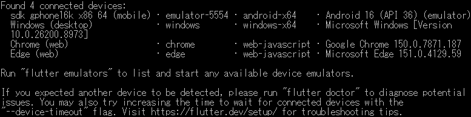](./assets/cmd/M_CMD_02-02_flutter=devices-R.png)  
  
  
#### ファイルバックアップ  
<details>  
<summary>  
　  
　  
  
</summary>   
   
　｢Coding｣で作成したファイルをバックアップ。  
#### Androidフォルダ生成  
```pwsh  
flutter create --platforms=android --project-name tmct_flt .  
```  
  
</details>  
  
　　[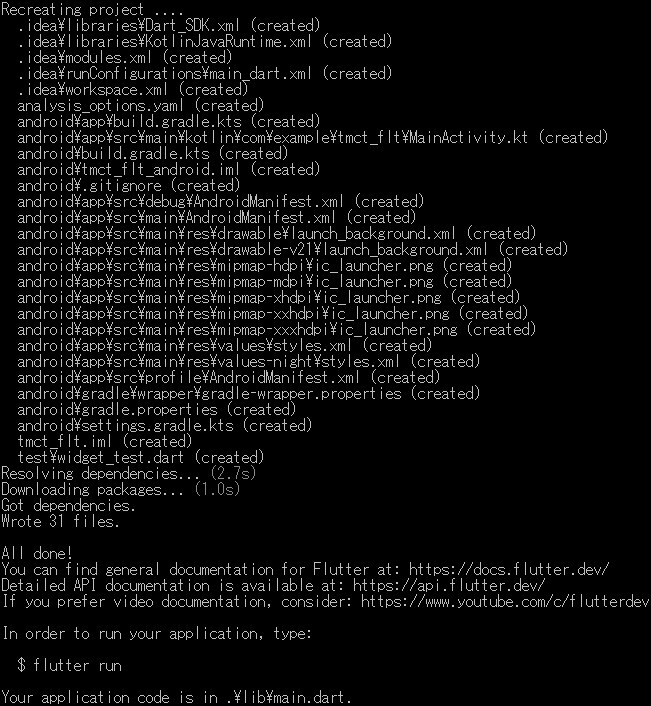](./assets/cmd/M_CMD_02-03_flutter=create=--platforms=android=--project-name-R.png)  
  
#### パッケージ取得  
<details>  
<summary>  
　  
　  
  
</summary>   
   
```pwsh  
flutter pub get  
```  
  
</details>  
  
　　[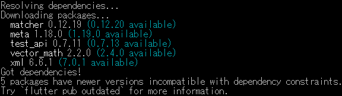](./assets/cmd/M_CMD_02-04_flutter=pub=get-R.png)  
　  
#### アイコン生成  
　アイコンファイル追加  
<details>  
<summary>  
　  
　  
  
</summary>   
   
```pwsh  
flutter pub add --dev flutter_launcher_icons  
```  
  
</details>  
  
　　[](./assets/cmd/M_CMD_02-05_flutter=pub=add=--dev=flutter_launcher_icons.png)  
  
  
　アイコンファイル登録  
<details>  
<summary>  
　  
　  
  
</summary>   
   
```pwsh  
dart run flutter_launcher_icons  
```  
  
</details>  
  
　　  
  
  
> [!NOTE]  
> iOS環境を作成していない場合の **Warning** メッセージ  
> 　[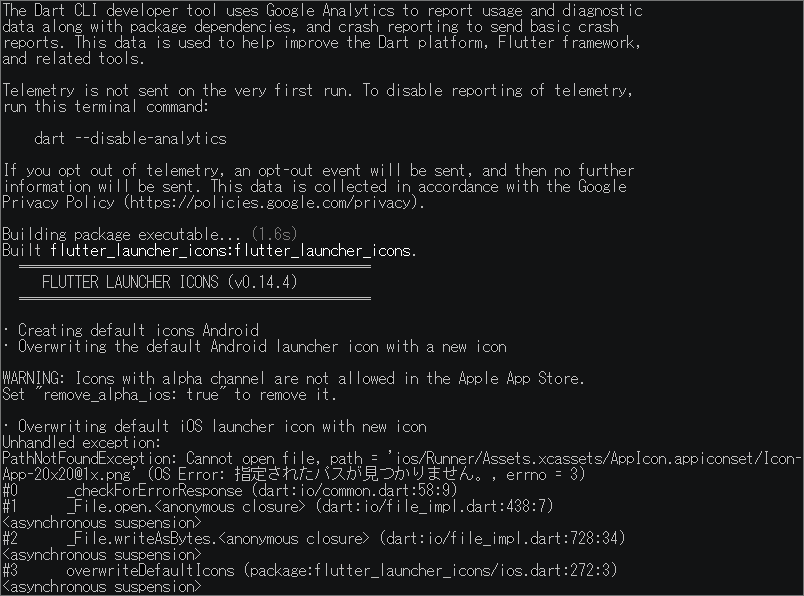](./assets/cmd/M_CMD_02-07_dart=run=flutter_luncher_icons-R-W.png)  
> 原因はiconファイルのフォルダ階層かファイル名の不一致。  
> またはpubspec.yamlで"ios:**True**"になってる ⇒ **False**へ変更。  
> 　  
  
<details>  
<summary>  
　  
　  
  
</summary>   
   
```pwsh  
flutter analyze  
```  
  
</details>  
  
　　  
  
> [!warning]  
> testフォルダを削除しなかった場合の **Error** メッセージ  
> 　[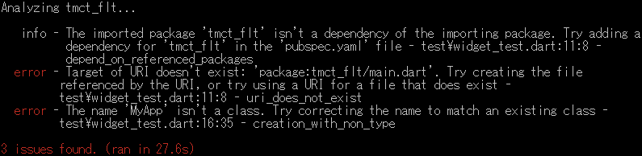](./assets/cmd/M_CMD_02-09_flutter=analyze--R-E.png)  
> 本チュートリアルでは自動生成されたサンプルテストを使用しないため、**test** フォルダは削除します。  
>　　 : .\ Project_dir \  test  
  
#### インストール  
　Emulator 確認 (FlutterからAndroid StudioのEmulatorが操作可能かを確認)  
<details>  
<summary>  
　  
　  
  
</summary>   
   
```pwsh  
flutter devices  
```  
  
</details>  
  
　[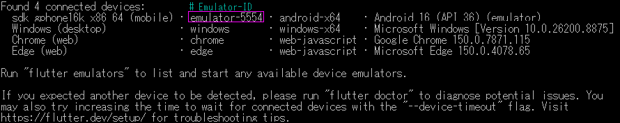](./assets/cmd/M_CMD_02-10_flutter=devices.png)  
　  
  
　アプリケーションを Emulator へインストール   
<details>  
<summary>  
　  
　  
  
</summary>   
   
```pwsh  
flutter run -d emulator-5554  
```  
  
</details>  
  
　[](./assets/cmd/M_CMD_02-11_flutter=run=-d=emulator-5554.png)  
  
　Emulator表示の遷移  
|Initial|Installing...|Running|After execution|  
|:---|:---|:---|:---|  
|[](./assets/prtsc/M_AS_Pixel7-HOME-initial.png)|[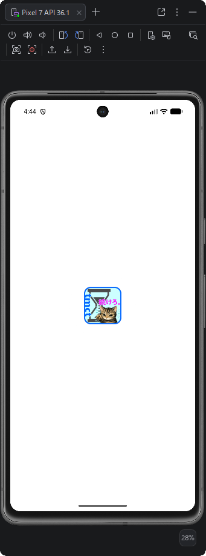](./assets/prtsc/M_AS_Pixel7-tmct-install.png)|[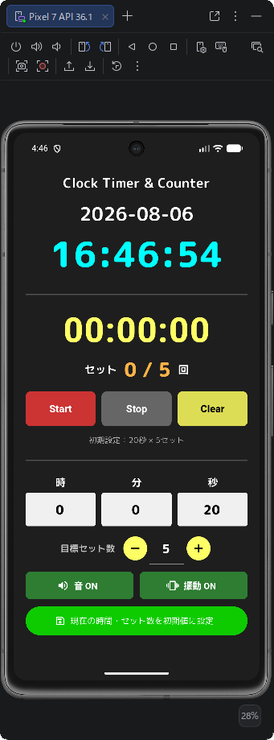](./assets/prtsc/M_AS_Pixel7-tmct-run.png)|[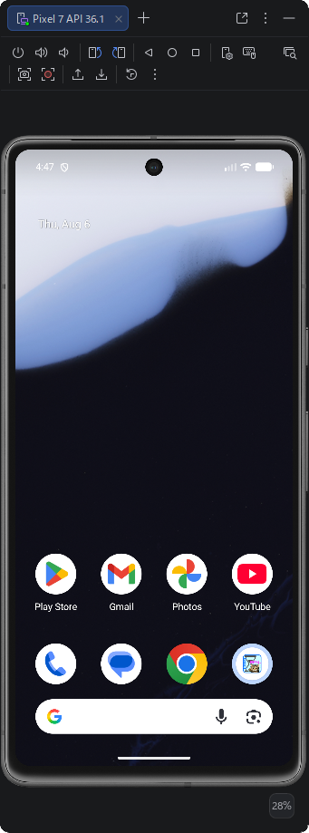](./assets/prtsc/M_AS_Pixel7-HOME-after.png)|  
  
## デバッグ (Emulator)													<!-- 02-03 -->  
　Android StudioからEmulatorを起動し、tmct_fltをデバッグ実行します。  
### 操作手順  
1. Emulatorを起動  
2. tmct_fltプロジェクトを開く  
3. 実行対象デバイスを選択  
4. Debugを実行  
5. ログ及び動作を確認  
  
### 主な確認項目  
- タイマーが設定値からカウントダウンする  
- Start、Stop、Clearが正しく動作する  
- カウンターが正しく更新される  
- 残り10秒で表示が変化する  
- 終了時に音及び振動が動作する  
- 設定値が保存される  
- Version等、設定内容が記録されている  
  
<!-- 後日、SoftwareDevelopmentGuide整備後に記載  
#### 項目設定方法  
　[🔗SoftwareDevelopmentGuideへのリンク]  
-->  
## 配布用アプリケーション(.apk)作成										<!-- 02-04 -->  
### バージョン設定  
　pubspec.yaml 内で設定  
　　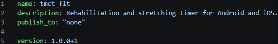  
　バージョン内容  
　　  
|Version Name|Details of Add-ons|  
|:---|:---|  
|Major version|主要機能の追加|  
|Minor version|機能変更、小規模追加|  
|Bug fixes|バグ対策|  
|build no|機能変更を伴わない修正、内部的なバグ対策|  
  
### Release Build  
#### 環境整備  
<details>  
<summary>  
　  
　  
  
</summary>   
   
```pwsh  
flutter clean  
```  
  
</details>  
  
　　[](./assets/cmd/M_CMD_02-12_flutter=clean.png)  
  
#### パッケージ取得  
<details>  
<summary>  
　  
　  
  
</summary>   
   
```pwsh  
flutter pub get  
```  
  
</details>  
  
　　[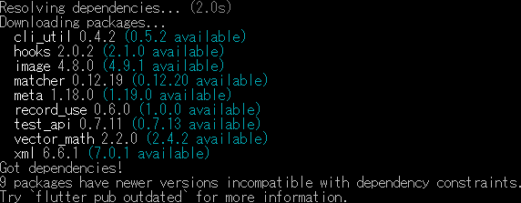](./assets/cmd/M_CMD_02-13_flutter=pub=get-R.png)  
  
#### Build  
<details>  
<summary>  
　  
　  
  
</summary>   
   
```pwsh  
　flutter build apk --release  
```  
  
</details>  
  
　　[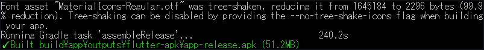](./assets/cmd/M_CMD_02-14_flutter=build=apk=--release.png)  
　Buildアプリケーション保存 🗁 : `Project folder` \build\app\outputs\flutter-apk\  
  
#### アプリケーションリネーム  
　Buildで生成される.apkは **app-release.apk** となっているので、**アプリケーション名+version.apk** へリネームする。  
  
> [!TIP]  
> **アプリケーション名_V1.0.0.0+1** といった名称でも、スマートフォンへインストールするとversionは表示されない。  
>  アプリ情報で確認できます。  
  