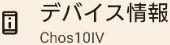
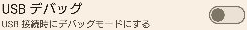
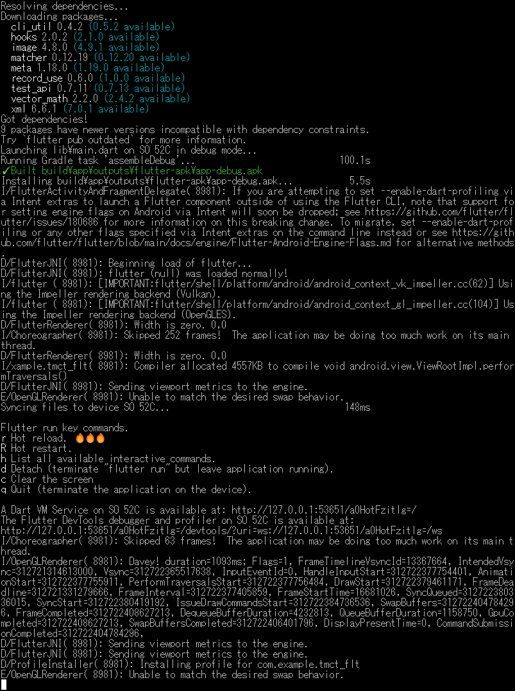

<p akugb=:keft>  
	  
	  
</p>  
<!--

-->  

# 実機検証																<!-- 04 -->  
　  
　スマートフォン[Xperia 10 IV]での検証を行います。  
  
> [!NOTE]  
> 縮小表示されている画像は⬇️で拡大されます。  
>   
> ```pwsh  
> ※ 記号例  
> 　🪟:デスクトップ、⬇️:マウスクリック、 [･･･]:ボタン、<･･･>:Press the Key、⇒:次動作、#･･･:コメント  
> 　"･･･":テキスト、a/b:選択(a or b)、｢･･･｣:ウィンドウ/メニュー/フォーム、  
> ```  
  
## USB接続でのインストール												<!-- 03-01 -->  
### スマートフォン側USBデバッグ準備  
　USBデバッグモードOn  
　  
|Image|Operation|  
|:---|:---:|  
|　**/**　 |👆|  
|　**/**　|👆|  
|　**/**　|👆 x**7**|  
|[](./assets/env/M_AD_M_lock-no.png)|入力|  
|[](./assets/env/M_AD_M_developer-options-on.png)|👆 ⇒ |  
|　**/**　|👆|  
|　**/**　|👆|  
|　**/**　|`(　〇)`👆|  
|[](./assets/env/M_AD_M_developer-options-usb-on.png)|[**OK**]👆 ⇒ HOME画面へ|  
| スマートフォンとPCをUSB接続||  
||確認|  
  
### アプリケーションインストール & 実行  
#### PC側作業  
　  
```pwsh  
　flutter devices <⏎>  
```  
　[](./assets/prtsc/03-01-01_flutter-devices.png)  
```pwsh  
　flutter run -d <実機のdevice-id> <⏎>  
```  
　[](./assets/prtsc/03-01-01_flutter-devices.png)  
  
#### 画面遷移  
　  
|Initial|Installing...|Running|After execution|  
|:---|:---|:---|:---|  
| [](./assets/env/M_AD_home03.png)>|[](./assets/env/M_AD_home-install.png)|[](./assets/env/M_AD_tmct.png)|[](./assets/env/M_AD_home04.png)|  
  
## 検証																	<!-- 03-03 -->  
### 操作手順  
1. Xperia 10 IVでtmct_fltを起動  
2. タイマーを設定  
3. 各操作を実行  
4. 音・振動・表示を確認  
5. アプリを終了／再起動して設定保持を確認  
  
### 主な確認項目  
  
- タイマーが設定値からカウントダウンする  
- Start、Stop、Clearが正しく動作する  
- カウンターが正しく更新される  
- 残り10秒で表示が変化する  
- 終了時に音及び振動が動作する  
- 設定値が保存される  
- アプリ終了後に再起動出来る  
- HOMEへ戻った後、再起動出来る  
- Version等、設定内容が記録されている  
  
<!-- 後日、SoftwareDevelopmentGuide整備後に記載  
#### 項目設定方法  
　[🔗SoftwareDevelopmentGuideへのリンク]  
-->  
