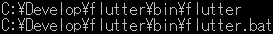
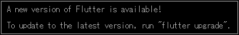
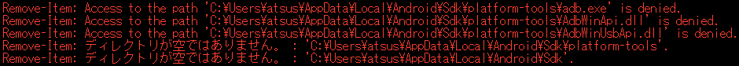
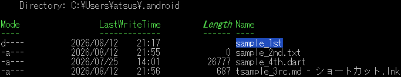
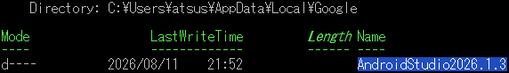
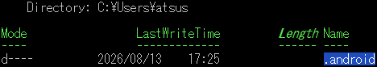

<p akugb=:keft>  
	  
	  
</p>  

<!--

-->
  
# 開発環境初期化  
　インストール済みの **Flutter** と **Android Studio**  及びその環境、生成物の削除を行います。  
> [!CAUTION]  
> この手順では、Flutter SDK、Android SDK、Android Emulator、  
> Android Studioの設定及び各種キャッシュを削除します。  
>  
> **既存の Flutter / Android 開発環境を継続して使用する場合は、  
> この手順を実行しないでください。**  
>  
> 削除したSDK、仮想端末及び設定は元に戻せません。  
> 必要なプロジェクト、設定、仮想端末及びファイルがある場合は、  
> 必ず事前にバックアップしてください。  
  
> [!NOTE]  
> 凡例  
> [](./assets/env/M_legend.png)  
>
> 縮小画像 (マウスカーソルが  に変化する画像) は  で拡大表示します。  
>
> Source code / コマンド は   でText表示します (表示されたTextの右上にある   でコピー)。  
>
>  ブラウザを **Darkモード** にして頂けると、見やすくなります。  

## 環境確認                                                         <!-- APP -->  
### 　Flutter SDK 環境                                              <!-- APP-01 -->  
　この章のコマンドは全て にて実行　　　※`<⏎>` : Enter key press  
```  
　現在の開発環境確認  
  
　Path確認  
```pwsh  
　where.exe flutter <⏎>  
```  
　　  
  
　Flutter確認  
```pwsh  
　flutter doctor -v <⏎>  
```  
　　[](./assets/prtsc/APP-02_flutter-doctor.png)  
  
### 　Android 環境  
　既存環境確認  
```pwsh  
　Get-ChildItem Env: |  
　    Where-Object {  
　        $_.Name -match 'ANDROID|JAVA|FLUTTER|DART|GRADLE|PUB'  
　    } |  
　    Sort-Object Name <⏎>  
```  
　　  
  
　Path確認  
```pwsh  
$env:Path -split ';' |  
    Where-Object {  
        $_ -match 'flutter|android|dart|gradle|java'  
    } <⏎>  
```  
　　  
  
## 環境削除									    				    <!-- APP-02 -->  
  
> [!WARNING]  
> 本章以降のコマンドは対象ディレクトリを確認してから実行してください。  
> 環境によってインストール先が異なる場合があります。  
  
### プロジェクト内のBuild生成物 削除  
```pwsh  
　flutter clean <⏎>  
```  
　`# 正常に削除できればメッセージ無し  `  

#### 　Flutterのバージョンアップがあった場合
　[](./assets/prtsc/APP-02-00_flutter-clean-info.png)  
> [!TIP]
> アップグレードする場合  
>　```
>　　flutter upgrade <⏎>  
>　```  
　　　　⇒ [🔗アップグレードメッセージ](./assets/prtsc/APP-02-00_flutter-upgrade.png)　　　　　　　　　# 長いので省略、詳細は🔗⬇️
  
### Android Studio 削除  
　EmulatorはAndroid Studioから削除  
　残骸が残っていたら削除 : %USERPROFILE%\.android\avd  
　🖥️左下｢ ️  ]⬇️ ⇒ ｢  ｣右⬇️ ⇒ ｢  ｣⬇️ ⇒  
　｢⚙️Window｣ ⇒ ｢　　｣⬇️ ⇒ 「アンインストール」  
  
### Android Studio 削除確認 残項目があれば強制削除  
```pwsh  
　Test-Path "C:\Program Files\Android\Android Studio" <⏎>  
```  
　true　　　　　　　　　　# 環境が存在する  
```pwsh  
　Remove-Item -Recurse -Force "C:\Program Files\Android\Android Studio" <⏎>  
```  
　`# メッセージ無し　※正常に削除された場合、メッセージは出力されない`  
  
### Android SDK 環境 削除  
```pwsh  
　Remove-Item -Recurse -Force "$env:LOCALAPPDATA\Android\Sdk" <⏎>  
```  
　[](./assets/prtsc/APP-02-01a_remove-item.png)  
　　　　　　　　　　　  
　[](./assets/prtsc/APP-02-01b_remove-item.png)  
　　　　　　　　　　　  
　[](./assets/prtsc/APP-02-01c_remove-item.png)  
　残環境 **：** $HOME\AppData以下はこの後削除します。  
  
### $HOMEの環境 削除  
```pwsh  
　Get-ChildItem "$env:USERPROFILE\.android" <⏎>  
```  
　[](./assets/prtsc/APP-02-02_Get-ChildItem-android.png)  
```pwsh  
　Remove-Item -Recurse -Force "$env:USERPROFILE\.android" <⏎>  
```  
　`# メッセージ無し　※正常に削除された場合、メッセージは出力されない  `
  
### 設定 及び キャッシュ 削除  
> [!IMPORTANT]  
> Android Studioで生成されたディレクトリは "**AndroidStudio** "、"**Android Studio**"等のバリエーションが存在します。  
> **Get-ChildItem** で検索出来たディレクトリそれぞれに適した **Remove-Item** コマンドを実行して下さい。  
#### Local環境/キャッシュ  
　AppData\Local\Google\  
```pwsh  
　Get-ChildItem "$env:LOCALAPPDATA\Google" -Directory -Filter "Android*" <⏎>  
```  
　　[](./assets/prtsc/APP-02-03_Get-ChildItem-Loal-Android.png)  
  
```pwsh  
　Remove-Item -Recurse -Force $env:LOCALAPPDATA\Google\ディレクトリ名 <⏎>  
```  
　`# メッセージ無し　※正常に削除された場合、メッセージは出力されない  `
  
　AppData\Roaming\Google\  
```pwsh  
　Get-ChildItem "$env:APPDATA\Google" -Directory -Filter "Android*" <⏎>  
```  
　　[](./assets/prtsc/APP-02-04_Get-ChildItem-Roaming-Android.png)  
```pwsh  
　Remove-Item -Recurse -Force "$env:APPDATA\Google\ディレクトリ名" <⏎>  
```  
  
#### Gradleキャッシュ 削除  
```pwsh  
　Get-ChildItem "$env:USERPROFILE\.gradle" <⏎>  
```  
　　[](./assets/prtsc/APP-02-05_Get-ChildItem-grable.png)  
```pwsh  
　Remove-Item -Recurse -Force "$env:USERPROFILE\.gradle" <⏎>  
```  
　[](./assets/prtsc/APP-02-06_Remove-Item-grable.png)  
　# プログレスバーの消滅で削除完了  
  
### Flutter SDK 削除  
```pwsh  
　where.exe flutter <⏎>  
```  
　[](./assets/prtsc/APP-02-07_where.exe-flutter.png)  
```pwsh  
　Get-ChildItem "C:\Develop\flutter" <⏎>  
```  
　[](./assets/prtsc/APP-02-07_where.exe-flutter.png)  
```pwsh  
　Remove-Item -Recurse -Force "C:\Develop\flutter" <⏎>  
```  
　[](./assets/prtsc/APP-02-09_Remove-Item-flutter.png)  
　`# プログレスバーの消滅で削除完了  `
  
### Flutter & Dart 設定･キャッシュ 削除  
```pwsh  
　$dartPaths = @(  
    "$env:APPDATA\.dart",  
    "$env:APPDATA\.dart-tool",  
    "$env:LOCALAPPDATA\.dartServer"  
　)  
  
　foreach ($path in $dartPaths) {  
    if (Test-Path $path) {  
        Remove-Item -Recurse -Force $path  
    }  
　} <⏎>　　　　　# ⚠️<⏎>前の"}"までコピーして実行  
```  
　`# 実行メッセージが一瞬表示される`。  
　`# 他のメッセージが無く、プロンプトが表示されれば削除完了`  
  
```pwsh  
　Get-ChildItem "$env:LOCALAPPDATA\Pub\Cache" <⏎>  
```  
　[](./assets/prtsc/APP-02-10_Get-ChildItem-Local-flutter.png)  
```pwsh  
　Remove-Item -Recurse -Force "$env:LOCALAPPDATA\Pub\Cache" -ErrorAction SilentlyContinue <⏎>  
```  
　[](./assets/prtsc/APP-02-11_Remove-Item-Local-flutter.png)  
　`# プログレスバーの消滅で削除完了  `
  
　🗁 : " **C:\Development\flutter** " を削除  
  
## 再起動 ⇒ 削除確認                                               <!-- APP-03 -->  
### 削除対象  
　　　･Windows 環境変数  
　　　･Git for Windows  
　　　･VS Code 機能拡張   
　　　･Flutter SDK  
　　　･Android Studio  
　　　･Android SDK  
　　　･Android Emulator  
  
```pwsh  
　Get-ChildItem "$env:USERPROFILE" -Force -Directory |  
    Where-Object {  
        $_.Name -match 'android|flutter|dart|gradle'  
    } <⏎>  
```  
　  
```pwsh  
　Remove-Item -Recurse -Force "$env:USERPROFILE\.android" <⏎>  
```  
　`# 正常に削除できればメッセージ無し  `
```pwsh  
　Get-ChildItem "$env:LOCALAPPDATA" -Force -Directory |  
    Where-Object {  
        $_.Name -match 'android|flutter|dart|gradle|pub'  
    } <⏎>  
```  
　  
```pwsh  
　Remove-Item -Recurse -Force "$env:LOCALAPPDATA\上記DIR" <⏎>  
```  
　`# Get-ChidlItemで抽出されたDIRを個別に削除`  
　`# 正常に削除できればメッセージ無し`  
  
  
  
```pwsh  
　Get-ChildItem "$env:APPDATA" -Force -Directory |  
    Where-Object {  
        $_.Name -match 'android|flutter|dart|gradle|pub'  
    } <⏎>  
```  
　  
```pwsh  
　Remove-Item -Recurse -Force "$env:APPDATA\.dart-tool" <⏎>  
```  
　`# 正常に削除できればメッセージ無し`  
  
#### 　　残DIRの削除で初期化完了  