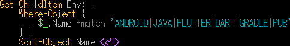
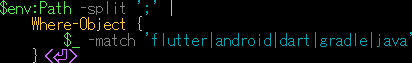
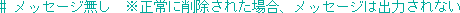
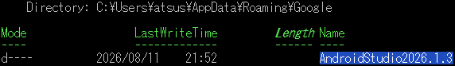
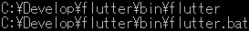
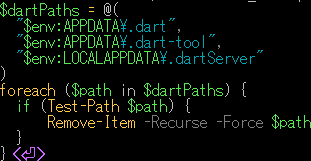
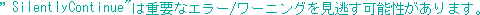
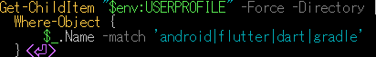
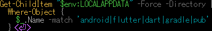
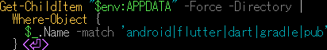

<p akugb=:keft>  
	  
	  
</p>  
  
<!--  
  
-->  
  
# 開発環境初期化  
　インストール済みの **Flutter** と **Android Studio**  及びその環境、生成物の削除を行います。  
> [!CAUTION]  
> この手順では、Flutter SDK、Android SDK、Android Emulator、  
> Android Studioの設定及び各種キャッシュを削除します。  
>  
> **既存の Flutter / Android 開発環境を継続して使用する場合は、  
> この手順を実行しないでください。**  
>  
> 削除したSDK、仮想端末及び設定は元に戻せません。  
> 必要なプロジェクト、設定、仮想端末及びファイルがある場合は、  
> 必ず事前にバックアップしてください。  
  
> [!NOTE]  
> 凡例  
> [](./assets/env/M_legend.png)  
>  
> 縮小画像 (マウスカーソルが  に変化する画像) は  で拡大表示します。  
>  
> Source code / コマンド は   でText表示します (表示されたTextの右上にある   でコピー)。  
>  
>  ブラウザを **Darkモード** にして頂けると、見やすくなります。  
>  
>  コマンドは全て  で実行します。  
  
## 環境確認                                                         <!-- APP -->  
### 　Flutter SDK 環境                                              <!-- APP-01 -->  
　現在の開発環境確認  
　Path確認  
<details>  
<summary>  
　  
　  
  
</summary>   
   
```pwsh  
where.exe flutter  
```  
  
</details>  
  
　　  
  
　Flutter確認  
<details>  
<summary>  
　  
　  
  
</summary>   
   
```pwsh  
flutter doctor -v  
```  
 
</details>  
 
　[](./assets/cmd/M_CMD_APP-02_flutter=doctor=-v-R.png)  
  
> [!warning]  
> Flutterの新しいバージョンが存在する場合のメッセージ  
> 　　　　　　　　　　　　　　　  
> 　  
> アップグレード手順  
>  AndroidStudioを終了してから実行すること。  
> <details>  
> <summary>  
> 　  
> 　  
>  
> </summary>   
>  
> ```pwsh  
> flutter upgrade  
> ```  
>   
> </details>  
>   
> 　[](./assets/cmd/M_CMD_00-02_flutter=upgrade-R.png)  
### 　Android 環境  
　既存環境確認  
<details>  
<summary>  
　  
　  
  
</summary>   
   
```pwsh  
Get-ChildItem Env: |  
    Where-Object {  
        $_.Name -match 'ANDROID|JAVA|FLUTTER|DART|GRADLE|PUB'  
    } |  
    Sort-Object Name  
```  
</details>  
  
　　  
  
  
　Path確認  
<details>  
<summary>  
　  
　  
  
</summary>   
   
```pwsh  
$env:Path -split ';' |  
    Where-Object {  
        $_ -match 'flutter|android|dart|gradle|java'  
    }  
```  
  
</details>  
  
　　  
  
## 環境削除									    				    <!-- APP-02 -->  
  
> [!WARNING]  
> 本章以降のコマンドは対象ディレクトリを確認してから実行してください。  
> 環境によってインストール先が異なる場合があります。  
  
### プロジェクト内のBuild生成物 削除  
<details>  
<summary>  
　  
　  
  
</summary>   
   
```pwsh  
flutter clean  
```  
  
</details>  
  
　　  
  
### Android Studio 削除  
　EmulatorはAndroid Studioから削除  
　残骸が残っていたら削除 : %USERPROFILE%\.android\avd  
　 左下  ️️   ⇒    右️ ⇒    ⇒  
　 ⚙️Window  ⇒    ️ ⇒  アンインストール    
  
### Android Studio 削除確認 残項目があれば強制削除  
<details>  
<summary>  
　  
　  
  
</summary>   
   
```pwsh  
Test-Path "C:\Program Files\Android\Android Studio" <⏎>  
```  
</details>  
  
　true　　　　  
  
<details>  
<summary>  
　  
　  
  
  
</summary>   
   
```pwsh  
Remove-Item -Recurse -Force "C:\Program Files\Android\Android Studio"  
```  
  
</details>  
  
　　　  
  
### Android SDK環境 削除  
<details>  
<summary>  
　  
　  
  
</summary>   
   
```pwsh  
Remove-Item -Recurse -Force "$env:LOCALAPPDATA\Android\Sdk"  
```  
  
</details>  
  
　[](./assets/cmd/M_CMD_APP-02-01a_remove-item.png)  
　　　　　　　　　　　  
　[](./assets/cmd/M_CMD_APP-02-01b_remove-item.png)  
　　　　　　　　　　　  
　[](./assets/cmd/M_CMD_APP-02-01c_remove-item.png)  
　残環境 **：** $HOME\AppData以下はこの後削除します。  
  
### $HOMEの環境 削除  
<details>  
<summary>  
　  
　  
  
</summary>   
   
```pwsh  
Get-ChildItem "$env:USERPROFILE\.android"  
```  
  
</details>  
  
　[](./assets/cmd/M_CMD_APP-02-02_Get-ChildItem-android.png)  
  
<details>  
<summary>  
　  
　  
  
</summary>  
  
```pwsh  
Remove-Item -Recurse -Force "$env:USERPROFILE\.android"  
```  
</details>  
  
　  
  
### 設定 及び キャッシュ 削除  
> [!IMPORTANT]  
> Android Studioで生成されたディレクトリは "**AndroidStudio** "、"**Android Studio**"等のバリエーションが存在します。  
> **Get-ChildItem** で検索出来たディレクトリそれぞれに適した **Remove-Item** コマンドを実行して下さい。  
#### Local環境/キャッシュ  
　対象   : $HOME\AppData\Local\Google\  
<details>  
<summary>  
　  
　  
  
</summary>   
   
```pwsh  
Get-ChildItem "$env:LOCALAPPDATA\Google" -Directory -Filter "Android*"  
```  
  
</details>  
  
　[](./assets/cmd/M_CMD_APP-02-03_Get-ChildItem-Loal-Android.png)  
  
<details>  
<summary>  
　  
　  
  
</summary>   
   
```pwsh  
Remove-Item -Recurse -Force "$env:LOCALAPPDATA\Google\上記ディレクトリ名"  
```  
  
</details>  
  
　  
  
　対象  : $HOME\AppData\Roaming\Google\  
  
<details>  
<summary>  
　  
　  
  
</summary>   
   
```pwsh  
Get-ChildItem "$env:APPDATA\Google" -Directory -Filter "Android*"  
```  
  
</details>  
  
　[](./assets/cmd/M_CMD_APP-02-04_Get-ChildItem-Roaming-Android.png)  
  
<details>  
<summary>  
　  
　  
  
</summary>   
   
```pwsh  
Remove-Item -Recurse -Force "$env:APPDATA\Google\ディレクトリ名"  
```  
</details>  
  
　  
  
#### Gradleキャッシュ 削除  
<details>  
<summary>  
　  
　  
  
</summary>   
   
```pwsh  
Get-ChildItem "$env:USERPROFILE\.gradle"  
```  
  
</details>  
  
　[](./assets/cmd/M_CMD_APP-02-05_Get-ChildItem-grable.png)  
<details>  
<summary>  
　  
　  
  
</summary>   
  
```pwsh  
Remove-Item -Recurse -Force "$env:USERPROFILE\.gradle"  
```  
  
</details>  
  
　[](./assets/cmd/M_CMD_APP-02-06_Remove-Item-grable.png)  
　  
  
### Flutter SDK 削除  
<details>  
<summary>  
　  
　  
  
</summary>   
  
```pwsh  
where.exe flutter  
```  
  
</details>  
  
　[](./assets/cmd/M_CMD_APP-02-07_where.exe-flutter.png)  
  
<details>  
<summary>  
　  
　  
  
</summary>   
  
```pwsh  
Get-ChildItem "C:\Develop\flutter"  
```  
  
</details>  
  
　[](./assets/cmd/M_CMD_APP-02-08_ChildItem-flutter.png)  
  
<details>  
<summary>  
　  
　  
  
</summary>   
  
```pwsh  
Remove-Item -Recurse -Force "C:\Develop\flutter"  
```  
  
</details>  
  
　[](./assets/cmd/M_CMD_APP-02-09_Remove-Item-flutter.png)  
　  
  
### Flutter & Dart 設定･キャッシュ 削除  
<details>  
<summary>  
　  
　  
  
</summary>   
  
```pwsh  
$dartPaths = @(  
  "$env:APPDATA\.dart",  
  "$env:APPDATA\.dart-tool",  
  "$env:LOCALAPPDATA\.dartServer"  
)  
  
foreach ($path in $dartPaths) {  
  if (Test-Path $path) {  
      Remove-Item -Recurse -Force $path  
  }  
}   
```  
  
</details>  
  
　  
　  
  
<details>  
<summary>  
　  
　  
  
</summary>   
  
```pwsh  
Get-ChildItem "$env:LOCALAPPDATA\Pub\Cache"  
```  
  
</details>  
  
　[](./assets/cmd/M_CMD_APP-02-10_Get-ChildItem-Local-flutter.png)  
  
<details>  
<summary>  
　  
　  
  
</summary>   
  
```pwsh  
　Remove-Item -Recurse -Force "$env:LOCALAPPDATA\Pub\Cache" -ErrorAction SilentlyContinue  
```  
  
</details>  
  
　[](./assets/cmd/M_CMD_APP-02-11_Remove-Item-Local-flutter.png)  
　  
　　    
  
　 :  C:\Development\flutter を削除  
  
## 再起動 ⇒ 削除確認                                               <!-- APP-03 -->  
### 削除対象  
　　　･Windows 環境変数  
　　　･Git for Windows  
　　　･VS Code 機能拡張   
　　　･Flutter SDK  
　　　･Android Studio  
　　　･Android SDK  
　　　･Android Emulator  
<details>  
<summary>  
　  
　  
  
</summary>   
  
```pwsh  
Get-ChildItem "$env:USERPROFILE" -Force -Directory |  
  Where-Object {  
      $_.Name -match 'android|flutter|dart|gradle'  
  }  
```  
  
</details>  
  
　  
  
<details>  
<summary>  
　  
　  
  
</summary>   
  
```pwsh  
Remove-Item -Recurse -Force "$env:USERPROFILE\.android"  
```  
  
</details>  
  
　  
  
<details>  
<summary>  
　  
　  
  
</summary>   
  
```pwsh  
Get-ChildItem "$env:LOCALAPPDATA" -Force -Directory |  
  Where-Object {  
    $_.Name -match 'android|flutter|dart|gradle|pub'  
  }   
```  
  
</details>  
  
　  
  
<details>  
<summary>  
　  
　  
  
</summary>   
  
```pwsh  
Remove-Item -Recurse -Force "$env:LOCALAPPDATA\上記DIR"  
```  
  
</details>  
  
 　  
 　  
  
<details>  
<summary>  
　  
　  
  
</summary>   
  
```pwsh  
Get-ChildItem "$env:APPDATA" -Force -Directory |  
  Where-Object {  
    $_.Name -match 'android|flutter|dart|gradle|pub'  
  }  
```  
  
</details>  
  
　  
  
<details>  
<summary>  
　  
　  
  
</summary>   
  
```pwsh  
Remove-Item -Recurse -Force "$env:APPDATA\.dart-tool"  
```  
</details>  
  
 　  
#### 　　残DIRの削除で初期化完了  