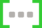

> [!NOTE]
> | | | |
> |:--|:--|:--|
> |　デスクトップ |　ターミナル |　ウィンドウ / ペイン / ダイアログ|
> |　フォルダ / ディレクトリ |　ファイル |　参照(資料)|
> |　省略 | **aaa**  **bbb**　選択|　編集 / コーディング / 描画 
> |　ダウンロード |　マウスクリック |　次動作|
> |　Key |：Enter key press |　コメント|
> |　テキスト |　ボタン |　ウィンドウ / メニュー / フォーム|