
  
	  
	  

  

<!--  
  
-->  

## Languages & Frameworks  
　[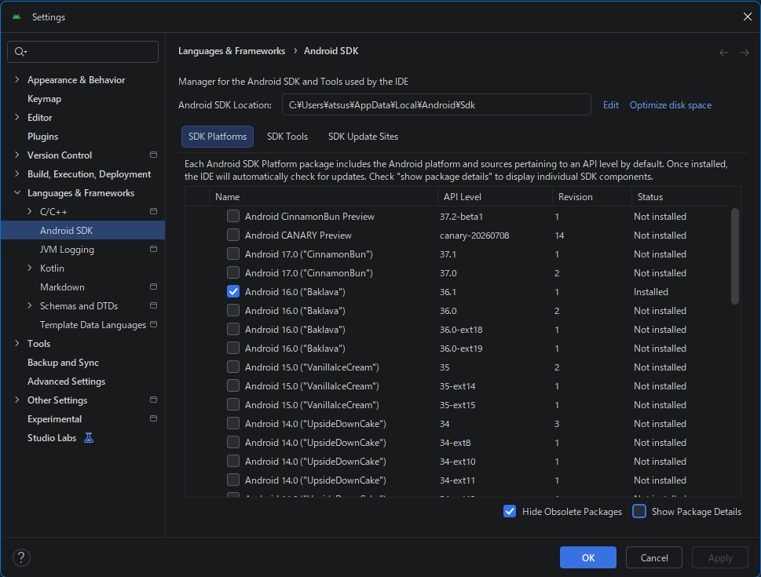](./assets/prtsc/AS-SDK-Introduntion/SDK-01i_Languages-and-Frameworks1.png)  
　  
  
## Languages & Frameworks Revent changes  
　[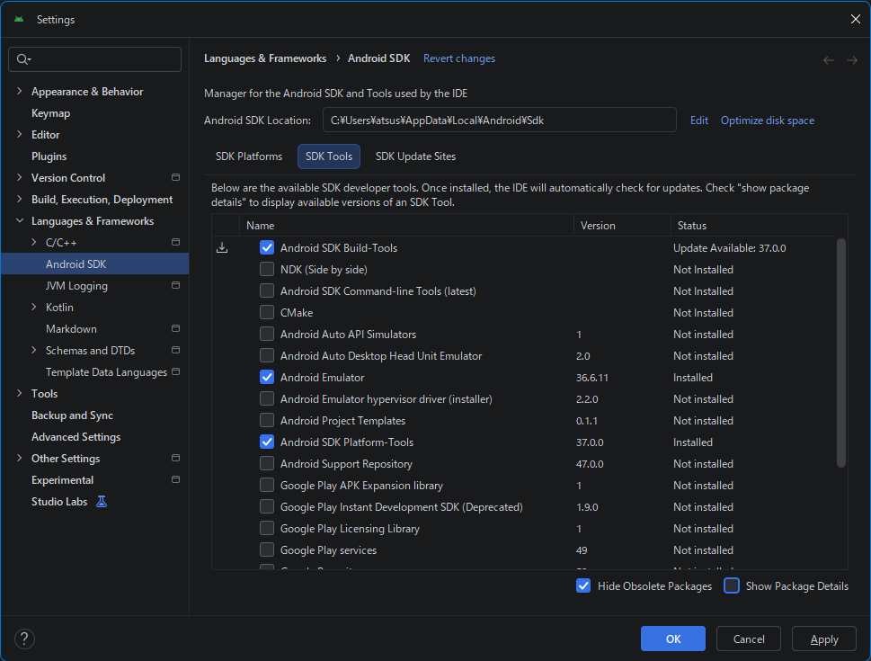](./assets/prtsc/AS-SDK-Introduntion/SDK-02i_Languages-and-Frameworks2.png)  
　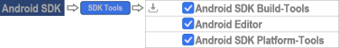  
  
## Languages & Frameworks Revent changes  
　[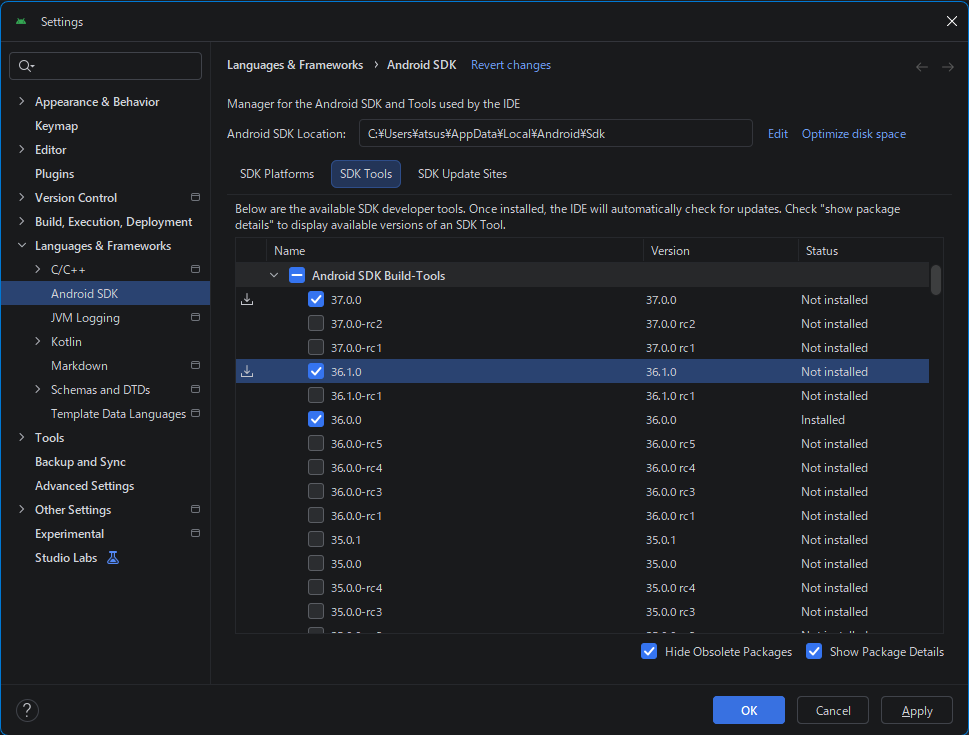](./assets/prtsc/AS-SDK-Introduntion/SDK-03i_Languages-and-Frameworks3.png)  
　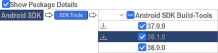  
  
## Languages & Frameworks Revent changes  
　[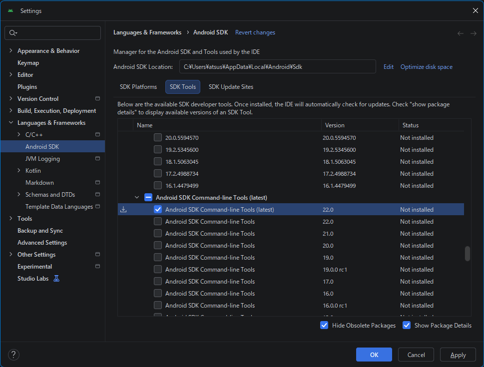](./assets/prtsc/AS-SDK-Introduntion/SDK-04i_Languages-and-Frameworks4.png)  
　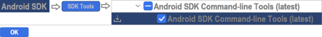  
  
## Confirm Cahnge  
　[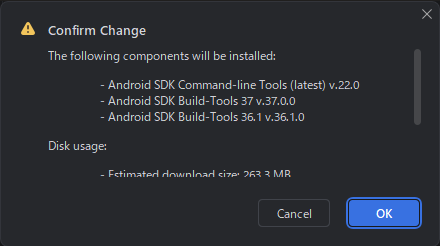](./assets/prtsc/AS-SDK-Introduntion/SDK-05_ConfirmChange.png)  
　  
  
## SDK Component Installer  
　[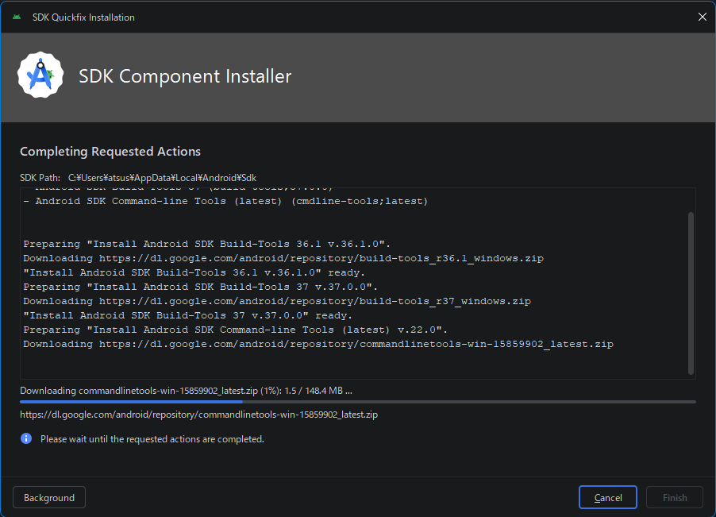](./assets/prtsc/AS-SDK-Introduntion/SDK-06_SDK-ComponentInstaller1.png)  [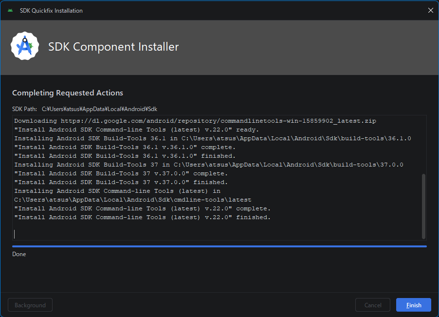](./assets/prtsc/AS-SDK-Introduntion/SDK-07_SDK-ComponentInstaller2.png)  
  
　  
  
## Settings  
　[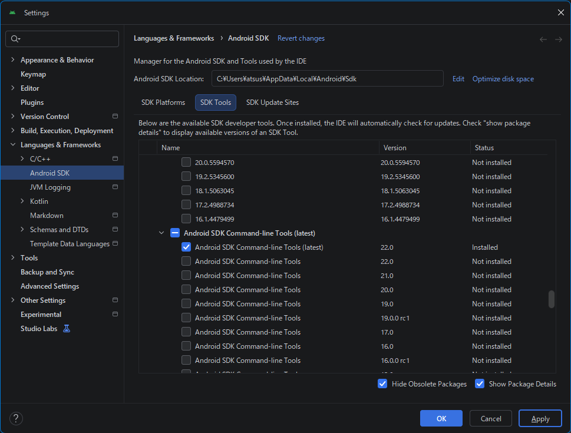](./assets/prtsc/AS-SDK-Introduntion/SDK-08_Languages-and-Frameworks5.png)  
　  